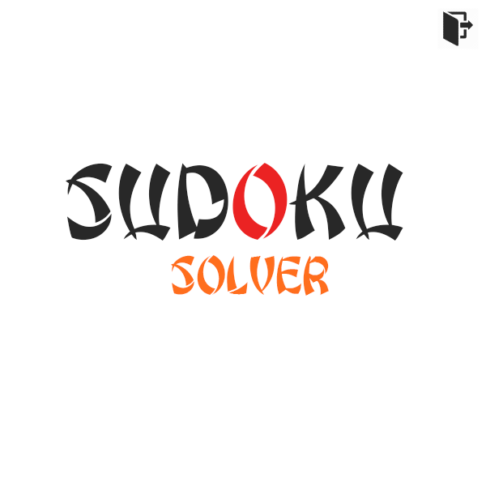
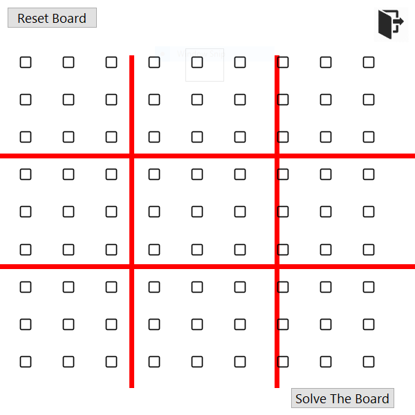
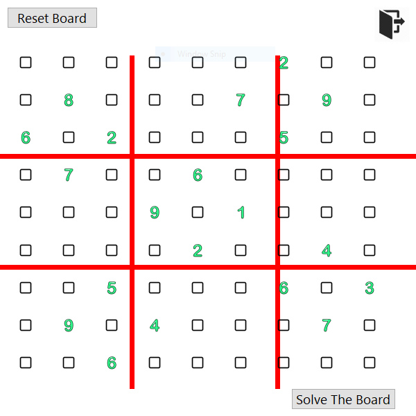
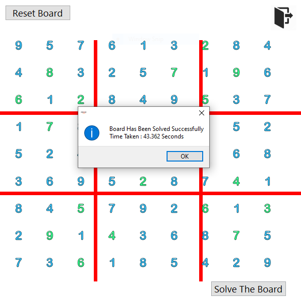
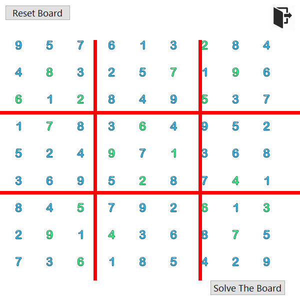
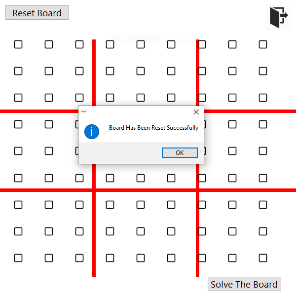

<h1 id="top">Sudoku Solver Project - GUI</h1>

<h3>Table Of Contents</h3>
<a href="#sf">Special Features</a> 
<a href="#glry">Gallery</a> 
<a href="#docs">Documentation</a> 
<a href="#downloads">Downloads</a> 

<h3 id="sf">Special Features</h3>
<ol>
    <li>Frameless GUI Application.</li>
			<li>Board Reset Available.</li>
			<li>Put Your Clues In The Empty Board And Get Them Solved Using The Solve Board Button</li>
			<li>Board Is Solved Using The Back Tracking Algorithm.</li>
			<li>
				Time Taken To Solve The Sudoku Problems Depends Upon 2 Factors :
				<ul>
					<li>The Difficulty Of The Problem.</li>
					<li>Computation Ability Of The Computer At Which The Programme Is Being Runned.</li>
				</ul>
			</li>
</ol>

<h3 id="glry">Gallery</h3>

<h3 id="docs">Documentation</h3>
The File ("Documentation.txt") Includes The Documentation For The Following: 
<ul>
    <li>Functions</li>
</ul>

<h3 id="downloads">Downloads</h3>
<a href="Snips.rar">Download Gallery</a> 
<a href="rps.exe">Download Standalone Executable</a> 
<a href="Documentation.txt">Download Complete Documentation</a> 
<a href="rps.py">Download rps.py [main]</a> 
<a href="sps.rar">Download Complete Source Code [main, module, resources]</a> 

<a href="#top">Go To Table Of Contents</a>
